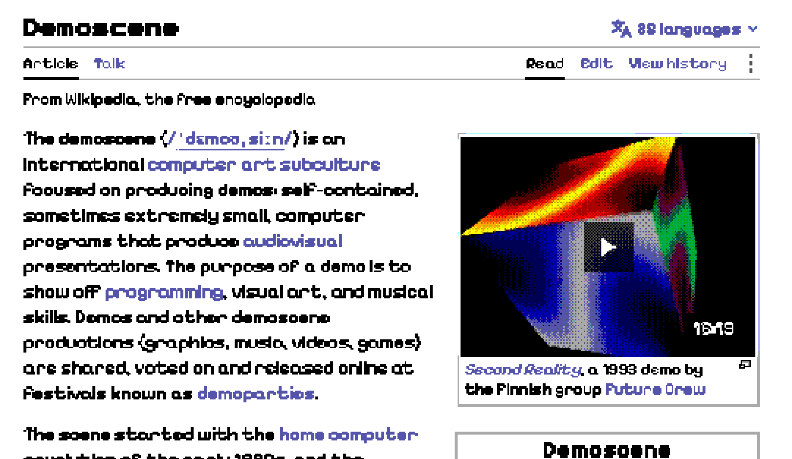
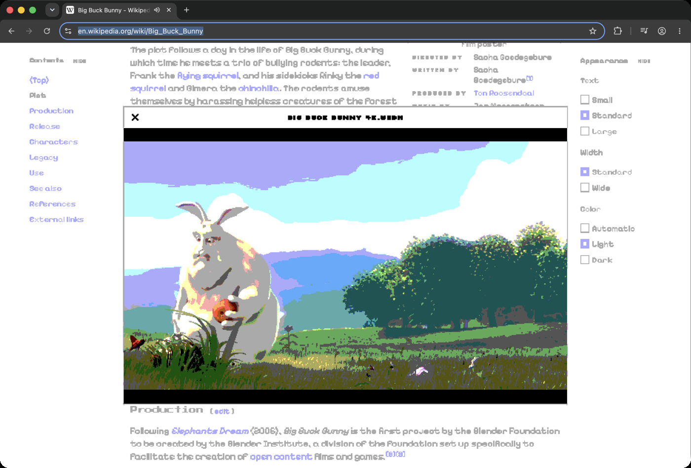
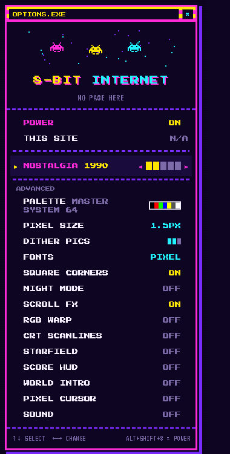

# 8-BIT INTERNET

**A Chrome extension that makes the whole web look like it's running on an 8-bit computer.**

Every page you visit gets redrawn on a chunky pixel grid, in the limited color palette of real
retro hardware like the Sega Master System, Amstrad CPC or BBC Micro. Your pages still look
like themselves: Wikipedia is still white with blue links. It's as if someone rebuilt the
modern web on a 1980s machine and did their best with what they had.

It isn't a theme or a font swap. The page is re-rendered live, so scrolling, animations and
even playing video all stay pixelated.





---

## Install it in 1 minute

You don't need to know how to code. You only need Google Chrome.

1. **Download the extension:**
   [**⬇ 8bit-internet.zip**](https://github.com/danroblewis/8bit_internet/raw/main/dist/8bit-internet.zip)
2. **Unzip it.** Double-click the downloaded file and a folder called `8bit-internet` appears.
   Leave it somewhere it won't get deleted, such as your Documents folder.
3. **Open Chrome's extensions page.** Paste this into the address bar and press Enter:
   ```
   chrome://extensions
   ```
4. **Turn on "Developer mode"** with the switch in the **top-right corner** of that page.
5. **Click "Load unpacked"** (top-left) and select the `8bit-internet` folder you unzipped.
6. **Done!** Open any website, for example [Wikipedia](https://en.wikipedia.org/wiki/Video_game).

**Tip:** click the puzzle-piece icon 🧩 next to Chrome's address bar and pin
**8-BIT INTERNET**, so its space-invader button is always one click away.

### Using it

- **Click the space-invader button** to open the options menu. It's a little 8-bit menu, and
  the arrow keys work too.
- **Slide NOSTALGIA** to travel back in time. Further back means bigger pixels, fewer colors
  and more retro extras.
- **Press Alt+Shift+8** (Option+Shift+8 on a Mac) to switch the whole thing on and off.
- **Turn it off for one website** with **THIS SITE** in the menu.

### Removing it

Go to `chrome://extensions` and click **Remove** on 8-BIT INTERNET.

---

## Nostalgia levels

| Level | Pixel size | Palette | What you get |
|-------|-----------|---------|--------------|
| **1995** | small | MSX2, 256 colors | Subtle: real fonts, gentle pixels |
| **1990** *(default)* | small | Sega Master System, 64 colors | Pixel fonts, dithered pictures, scroll effects |
| **1987** | medium | Amstrad CPC, 27 colors | Chunkier and bolder |
| **1984** | medium | BBC Micro, 8 colors | Plus CRT scanlines |
| **1982** | large | BBC Micro, 8 colors | Everything: score HUD, "WORLD 1-1" intro, RGB warp, pixel cursor, starfield |

Every individual setting can be changed under **ADVANCED** in the menu.



---

## For developers

```sh
git clone git@github.com:danroblewis/8bit_internet.git
cd 8bit_internet
npm install
npm start                        # opens Chrome with a separate test profile + the extension
npm start https://github.com     # ...or start on any page
npm run zip                      # rebuilds dist/8bit-internet.zip
```

Chrome reads an unpacked extension's files when it starts, so restart after editing the code
(or click ↻ on the extension in `chrome://extensions`).

**How it works.** A live SVG filter on the page's `<html>` element redraws everything onto
one global pixel grid, then snaps each color to the nearest color the palette allows.
Pictures get their own small filter that adds ordered dithering, lined up with the same grid.

```
extension/
  manifest.json      Chrome extension manifest (MV3)
  shared.js          palettes, nostalgia presets, default settings
  content/bit8.js    the whole effect: filters, fonts, dithering, scroll FX, HUD, sound
  popup/             the 8-bit options menu
  background.js      toolbar badge + Alt+Shift+8 shortcut
  fonts/             pixel fonts (open-source, OFL licensed, from Google Fonts)
tools/               test/benchmark scripts (puppeteer), used during development
```

**Known limits:**
- **Video:** videos get flat palette colors but no dithering.
- **Icon fonts:** an unusual icon font may show up as letters. Set **FONTS → ORIGINAL** if so.
- **Browser pages:** Chrome doesn't let any extension change its own pages (`chrome://`,
  the Web Store).
- **Performance:** bigger pixel sizes (the older nostalgia levels) take more graphics work.

---

## Cool features

- 🟦 **The pixel.** One global pixel grid for the whole page. Nothing is thinner than a pixel:
  thin lines and borders get redrawn as solid one-pixel lines, like a pixel artist would.
- 🎨 **Real hardware palettes:** MSX2 (256), Sega Master System (64), Amstrad CPC (27),
  BBC Micro (8), Game Boy, CGA, 1-bit and Neon.
- 🖼️ **Proper dithering:** photos and pictures get classic ordered (Bayer) dithering, while
  text and buttons stay in clean flat colors, just like 8-bit games drew them.
- 📺 **Works on video:** YouTube and Wikipedia videos play pixelated, in the palette.
- 🔤 **Pixel fonts everywhere:** Press Start 2P, Silkscreen, Pixelify Sans and VT323, sized so
  page layouts don't break.
- 🕹️ **The Nostalgia slider:** one control from subtle-1995 to full-arcade-1982.
- 🧩 **SNES-style mosaic:** images resolve from giant blocks to sharp pixels as you scroll to them.
- ⌨️ **Typewriter headings:** headings type themselves in as they scroll into view, and
  paragraphs step into place.
- 🌈 **RGB warp:** scroll fast and the screen splits into red and cyan like a glitching CRT.
- 📟 **CRT scanlines** for that old-TV glow.
- 🏆 **Score HUD:** earn points by scrolling and clicking, keep a hi-score per website, and
  get "COURSE CLEAR!" at the bottom of long pages.
- 🍄 **"WORLD 4-3" intro** with a pixel iris wipe when you open a site.
- 🔊 **Chiptune sound effects** synthesized on the fly: coin sounds on links, blips on hover,
  a fanfare at the end of the page (off by default).
- 🌙 **Night mode** turns bright pages dark, with photos keeping their real colors.
- ⭐ **Parallax starfield** behind dark pages.
- 🖱️ **Pixel-art mouse cursor.**
- 🎮 **Secret:** try ↑ ↑ ↓ ↓ ← → ← → B A on any page.
- ⚡ **Fast:** 60fps on a Retina MacBook at the default level. Everything runs on the graphics card.
- 🔒 **Private:** no network requests, no tracking, and the only permission is saving your
  settings.
